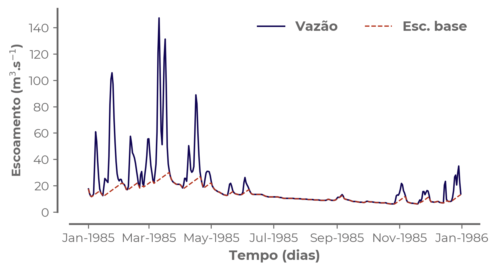

# Separação do escoamento de base (Hydrograph-py, função *`sepBaseflow`*)

Procedimento para separação da vazão em escoamento superficial e de base. A série de escoamento de base foi estimada a partir de dados observados de vazão da bacia hidrográfica do rio Corumbataí.

* Linguagem: Python;
* Tecnologia: Hydrograph-py [(Terink 2019)](https://app.readthedocs.org/projects/hydrograph-py/downloads/pdf/latest/);
* Período de dados: 1/1/1985 a 31/12/2019

### Bibliotecas necessárias:
```python
import pandas as pd
from Hydrograph.hydrograph import sepBaseflow
import matplotlib.pyplot as plt
```

### Resultado

