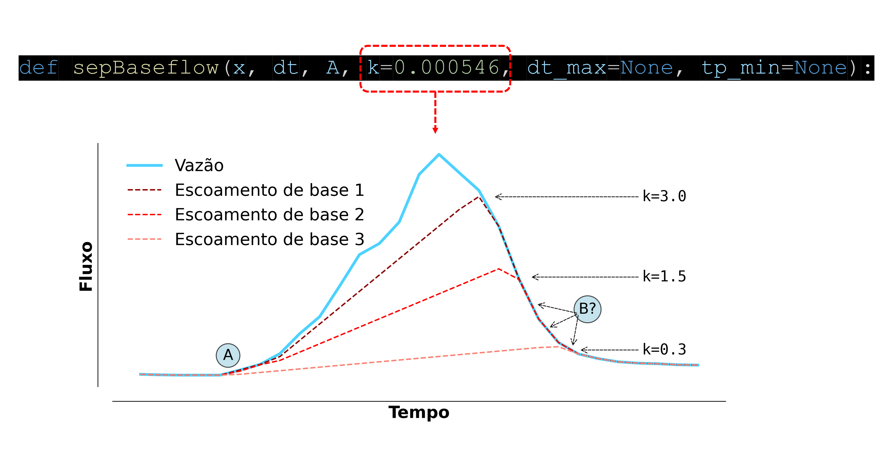

# Separação do escoamento de base
Hydrograph-py (função *`sepBaseflow`*)

Procedimento para separação do escoamento de base, a partir de séries temporais de vazão, utilizando o pacote Python **Hydrograph-py** (Terink 2019). Este pacote permite a separação, de maneira simples, da vazão em escoamento superficial direto e escoamento de base. Além disso, facilita a filtragem e o cálculo dos volumes de pico de vazão, dos volumes máximos de pico de vazão anual, entre outras análises hidrológicas. Aqui, a série de escoamento de base foi estimada a partir de dados observados de vazão da bacia hidrográfica do rio Corumbataí.

&nbsp;

### Ferramentas necessárias
* Python ;
* Tecnologia: Hydrograph-py [(Terink 2019)](https://app.readthedocs.org/projects/hydrograph-py/downloads/pdf/latest/);
* Série de vazão longa o suficiente

&nbsp;

### Bibliotecas necessárias e como importá-las:
```python
import pandas as pd
from Hydrograph.hydrograph import sepBaseflow
import matplotlib.pyplot as plt
```

&nbsp;

### Ajuste do parâmetro k
<p align="left">
  <br>
  <sub>Diagrama esquemático demonstrando a inclinação da reta do escoamento de base no hidrograma, que é controlada pelo parâmetro k da função <i>sepBaseflow</i> do pacote Python Hydrograph-py. Os valores do parâmetro k apresentados no gráfico estão em L.s<sup>-1</sup> km<sup>-2</sup> dia<sup>-1</sup>. No pacote Python Hydrography-py v. 1.0.1 (Terink 2019), a unidade deste parâmetro está em m<sup>3</sup> s<sup>-1</sup> km<sup>-2</sup> h<sup>-1</sup>.</sub>
</p>

&nbsp;

### Sugestão de ajuste do parâmetro k

Para melhor estimar o escoamento de base o valor do parâmetro k foi ajustado utilizando como referência o coeficiente N. Este coeficiente é determinado por meio de uma equação empírica que calcula a duração do escoamento superficial em dias. O período N começa no pico da vazão do curso hídrico e termina quando o escoamento superficial cessa.

<i>N = 0.827 x A<sup>0.2</sup></i>

em que N é o período de escoamento superficial em dias, e A é a área de drenagem da bacia hidrográfica em Km<sup>2</sup>.

&nbsp;

### Resultado

<p align="left">
  <br>
  <sub>Escoamento de base estimado a partir da série de vazão observada da bacia hidrográfica do rio Corumbataí, referente ao ano de 1985.</sub>
</p>

